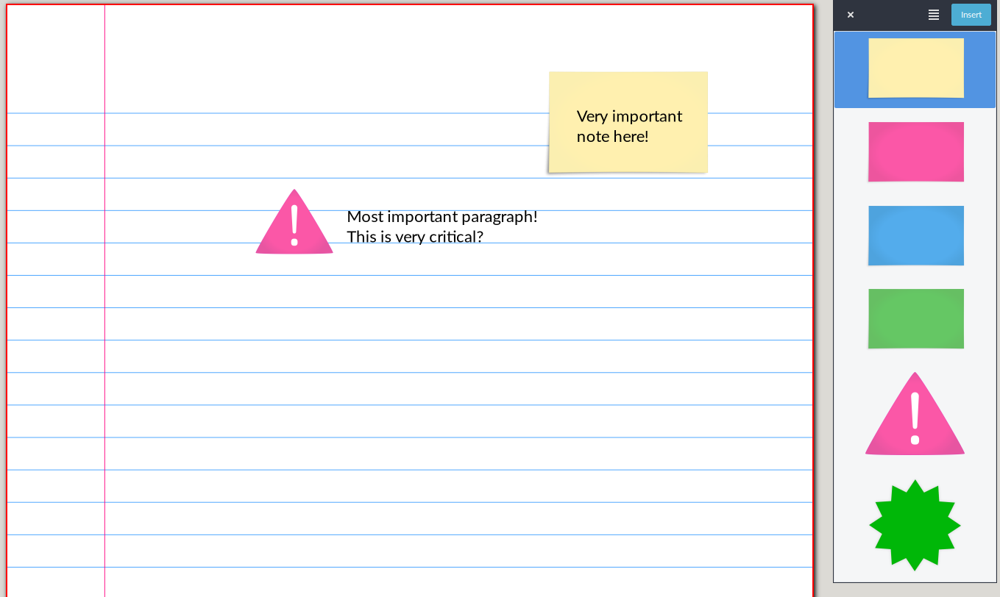

QuickLibrary, a plugin for Xournalpp
====================================
QuickLibrary is a plugin for Xournalpp on GNU/Linux which allows to quickly add images/graphical elements to your notes.

Installation
------------
Unpack the zip file in the plugin directory (~/.config/xournalpp/plugins/ or ~/.var/app/com.github.xournalpp.xournalpp/config/xournalpp/plugins/ if using flatpak user), then activate the plugin via the respective menu in Xournalpp.

Screenshot
----------

Limitations
-----------
* Import of SVG files will result in loss of quality (Xournalpp limitation);
* Drag-and-drop or insert at mouse cursor position is not possible;
* Works only on Linux (so far..).
